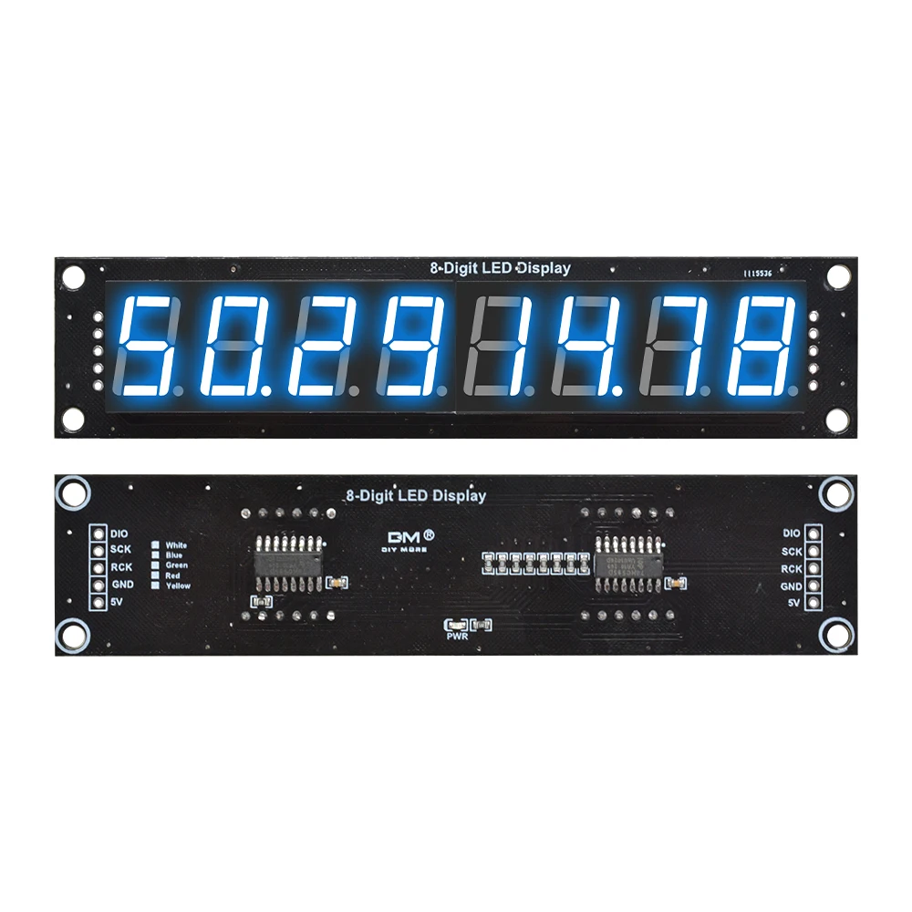
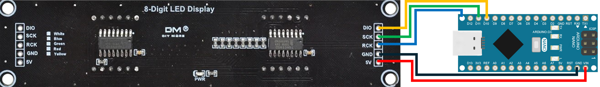

# Crispin Project: 7-Segment Display Control with 74HC595 and Arduino

## Description
This project uses an Arduino to control a 7-segment display through the 74HC595 shift register. Additionally, a Python script sends the current date and time from a computer to the Arduino via the serial port, allowing the information to be displayed on the screen.

## Included Files
- `crispin.ino`: Arduino code to receive data from the serial port and control the 7-segment display.
- `crispin.py`: Python script that sends the current date and time to the Arduino via serial communication.

## Requirements
### Hardware
- Arduino (any model compatible with 74HC595, I use Arduino Nano)
- 7-segment display with 74HC595 shift register from Aliexpress
   
- Connection wires
- Suitable power supply

### Software
- Arduino IDE
- Python 3.x
- `pyserial` library for Python (install with `pip install pyserial`)

## Installation and Usage
### 1. Arduino Setup
1. Upload the `crispin.ino` file to the Arduino using the Arduino IDE.
2. Connect the 7-segment display to the Arduino via the 74HC595.
3. Configure the serial port in the Arduino code to match the system.

### 2. PC Setup
1. Install Python 3 if it is not installed.
2. Install the `pyserial` library with the following command:
   ```sh
   pip install pyserial
   ```
3. Modify `crispin.py` to set the correct serial port for the Arduino connection.
4. Run the Python script:
   ```sh
   python crispin.py
   ```

The script will send the current date and time to the Arduino, which will display it on the 7-segment screen.

## Connection diagram


## License
This project is open-source. You are free to use and modify it.

## Author
Project developed by BaconA7X


